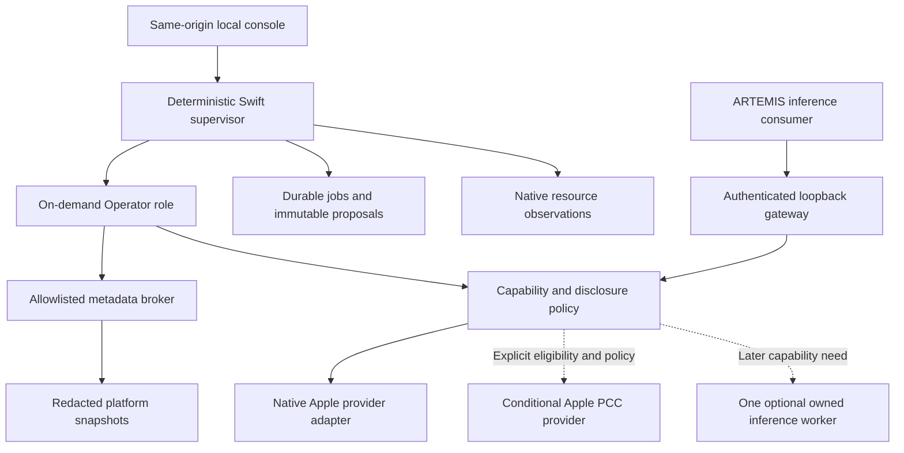

# Proposed architecture

Status: v0.3 discussion draft, 2026-10-03. Consumer order is confirmed: the platform's Operator Agent first, Google ARTEMIS second. Technical choices remain proposed; this document does not authorize implementation.

## Consumers and topology

The Operator explains platform health, provider availability, deferred requests and resource costs, then drafts bounded optimization proposals. It receives approved platform metadata and redacted diagnostics. General repository analysis and arbitrary file inspection are outside this initial workflow.

ARTEMIS is a later inference consumer. It owns Android observation, automation loops, tools and device authority. The platform supplies a tested inference contract and resource governance; it does not execute ARTEMIS tool calls or assume control over the device.

Swift is the proposed control plane because the initial provider and macOS resource APIs are native. The Apple adapter is proposed trusted code in that process; model-generated tool requests still pass through the broker. XPC separation is an alternative to evaluate, not an equivalent proven boundary. Start with one inference admission slot shared on demand. Apple controls its system-model residency; the platform can evict only an optional owned worker's allocations.

## Provider and capability registry

Prefer the Apple Foundation Models on-device adapter for the Operator on eligible Macs, including M2-class devices. Check runtime availability and expose reasons for unavailability. Hardware family alone does not establish OS support, enabled/downloaded system models, app eligibility or task suitability. [Hardware and models](hardware-and-models.md) records verified Apple API constraints.

Private Cloud Compute is conditional on supported OS/API, managed entitlement, distribution eligibility, service availability and quota. Verify permitted use for the proposed generic ARTEMIS gateway before any live ARTEMIS-to-PCC request. Local-only requests cannot use it. Display actual provider use and fail transparently when unavailable; cloud-inference permission does not authorize a patch executor.

Stable model aliases map to verified provider capabilities: input modalities, tool-call and schema support, context/output limits, streaming behavior, availability, ownership and allowed disclosure policy. Consumer identity and explicit requirements participate in selection. Model-name substrings, message counts and Flash/Pro labels do not establish capability. Validate the full conversation, including embedded images and tool results, before admission. Reject unsupported requirements instead of stripping them or inventing a successful answer.

ARTEMIS screenshot requests require tested image understanding and visual grounding. Apple's macOS 27 multimodal API accepts image attachments, so native on-device image inference is the first candidate on that OS tier; this does not prove Android automation quality or wire compatibility. Earlier OS tiers need separate capability handling. [Apple multimodal prompting](https://developer.apple.com/documentation/foundationmodels/analyzing-images-with-multimodal-prompting). A text model plus OCR is not automatically equivalent.

If native providers cannot satisfy the captured contract within policy and budget, evaluate one MLX or llama.cpp worker with a verified image-capable artifact; select one backend rather than implementing both. Empero's Qwen3.8-9B-Distill GGUF is an optional third-party candidate, not the mandatory Operator or a proven vision model. Its Q4_K_M artifact is listed as 5.78 decimal GB before runtime overhead. Pin publisher, revision, checksum, license, quantization, template and compatible engine. [Publisher card](https://huggingface.co/empero-ai/Qwen3.8-9B-Distill-GGUF).

## Authority and process boundaries

The supervisor owns policy, admission, persistent state and proposal validation. The Operator broker exposes typed status snapshots and selected diagnostics; it has no general filesystem, shell, raw-trace or direct database-read tool. The supervisor may read its own durable state through its separate allowlist and sanitize the result before providing it to inference. Model output cannot expand either allowlist.

An optional owned worker uses versioned, bounded framed stdio with request IDs, typed payloads, explicit errors and cancellation. This isolates failures and avoids another worker network listener. A same-user subprocess is not a security sandbox. Before private diagnostics or screenshots reach it, demonstrate actual confinement against unauthorized files, platform state, outbound network and child execution. Use synthetic/redacted fixtures until that gate passes. Apple-provider access and disclosure require their own documented checks.

ARTEMIS supplies tool declarations for its own harness. Returning a proposed tool call grants no new platform capability. Device-action permission, consumer task limits and stop behavior stay in ARTEMIS; admission limits on one inference call cannot bound its entire automation session.

## Resource and request lifecycle

The deterministic governor uses thermal state, memory pressure, measured headroom and power conditions. Apple exposes nominal, fair, serious and critical thermal states; an unverified 82°C cutoff is not the portable contract. [Apple thermal states](https://developer.apple.com/documentation/foundation/processinfo/thermalstate-swift.enum).

Bound context, images, output, retries, queue size and deadlines. Fair scheduling prevents a long ARTEMIS session from indefinitely starving Operator requests. Reject excess work with appropriate HTTP 429/503 errors and bounded retry guidance; never return a normal chat completion containing a busy notice. Streaming failures remain failures. See [gateway contract](gateway-contract.md).

Stop background admission under pressure, cancel at supported provider boundaries, and use hysteresis for recovery. For owned workers, release contexts/model references or terminate after a bounded grace period. MLX's memory limit is a guideline; clearing its allocation cache does not unload live tensors. [MLX memory limit](https://ml-explore.github.io/mlx/build/html/python/_autosummary/mlx.core.set_memory_limit.html), [cache clearing](https://ml-explore.github.io/mlx/build/html/python/_autosummary/mlx.core.clear_cache.html). Apple system-model eviction is outside this platform's authority. Validate cancellation and resource recovery separately for each provider.

## State, console and review

Recommend embedded SQLite for durable jobs, immutable proposal versions and decisions, bounded metadata JSONL for metrics, and Markdown exports. Raw diagnostics/screenshots are not logged by default. Application Support is conventional storage, not sandbox isolation. [Apple sandbox containers](https://developer.apple.com/documentation/security/accessing-files-from-the-macos-app-sandbox).

The console uses authenticated same-origin loopback HTTP and SSE. Validate host/origin, reject cross-origin mutation and separate Operator/ARTEMIS credentials. Approval binds an exact proposal digest, scope, base version and expiry; edits invalidate it. Waiting for review releases inference capacity. The MVP ends with reviewed proposals and manual export, without applying changes. Source-verified ARTEMIS configuration and offline limitations are documented in [ARTEMIS integration](artemis-integration.md).
