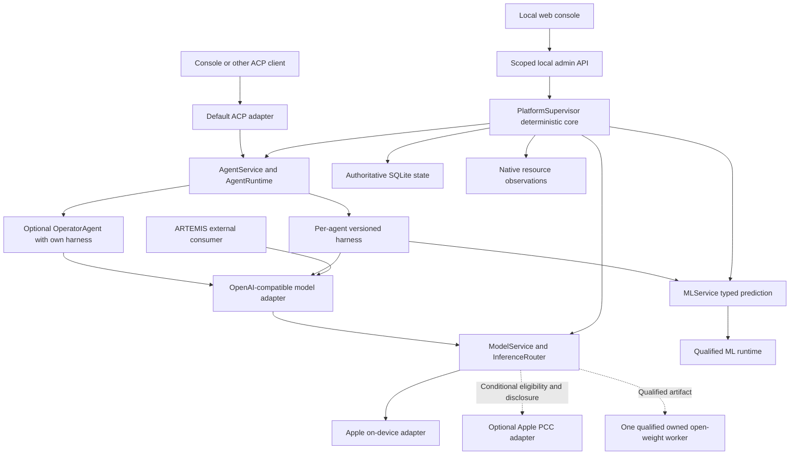

# Proposed architecture

Status: v0.9 discussion draft, 2026-10-04; bounded M1 implementation in progress per user approval (see [development](development.md)). Core scope corrected per the user's latest direction: the platform serves models and hosted agents through deterministic code; ACP agent serving and the OpenAI-compatible LLM interface are baseline facilities, while installed agents - including the Operator - are optional. Remaining technical designs are proposed; this document does not authorize work beyond the approved increment.

## Layers and components

| Layer | Components | Notes |
| --- | --- | --- |
| Client/UI adapters | Local console, OpenAI-compatible model adapter, ACP agent adapter | Separate contracts; the model API is the tested OpenAI subset and ACP is the default agent-facing protocol |
| Shared control plane | `PlatformSupervisor`: startup/shutdown, config and registry validation, auth and consumer scopes, resource governor/scheduler, backend lifecycle, quotas/deadlines/cancellation, authoritative SQLite state, bounded telemetry, admin API | Deterministic code; no LLM or agent is required for any of these operations |
| Model-serving plane | `ModelService` (LLM), `MLService` (typed non-generative ML), `InferenceRouter`, provider/runtime adapters | Contract validation, purpose/capability selection, bounded backend execution |
| Agent-serving plane | `AgentService`/`AgentRuntime`, versioned `AgentProfile`s and per-agent harnesses | Baseline facility; consumes model serving; never sits above control-plane authority |
| Runtime/hardware substrate | Apple native framework, qualified owned inference worker, optional constrained agent worker, native pressure/power/thermal observations | Logical layers are not process-isolation boundaries; claim confinement only after a verified boundary |

This is not a strict all-down stack: the control plane governs both model and optional agent work, and the agent module calls the model module through the same client contract external consumers use.

## Topology

The supervisor governs all serving modules without an Operator in the loop. Administrative, registry, status, and stop paths use neither LLM generation nor ML prediction. ModelService invokes LLM adapters and MLService invokes typed prediction runtimes, each after shared-core admission. Agent harnesses submit generative steps through the OpenAI-compatible client and ML steps through the registered typed prediction seam.

## Model serving

`POST /v1/chat/completions`, plus `GET /v1/models` where needed, is the declared model-serving subset; see the [gateway contract](gateway-contract.md). Model-only serving returns suggestions or tool-call data; it never executes a consumer's tool declarations. Configured aliases and purpose profiles, declared capabilities, context, tool/schema, streaming, and disclosure requirements select a provider deterministically against the actual device budget. There is no model-driven mandatory intent router and no substring/length routing; the shared core validates every admitted model request.

Provider adapters are peer categories selected by purpose and evidence, not an Apple default with an emergency fallback:

- Apple on-device Foundation Models, where OS, availability, and capability checks pass; Apple owns its model residency.
- Owned open-weight runtime adapters are first-class. The initial qualification considers one artifact/runtime pair, with the Empero Qwen distill GGUF as a candidate, not a committed choice; additional registered model profiles and adapters require their own compatibility/resource evidence rather than implementing every engine at once.
- Conditional Apple PCC subject to its separate entitlement/disclosure gate; see the [cloud policy](safety-and-approvals.md#foundation-models-and-optional-apple-cloud-inference). It is a conditional provider, not the project backbone.

The core remains operable when Apple Intelligence or any model is unavailable and can still serve an eligible owned route; no single provider is a prerequisite.

## Agent serving

`AgentRuntime` is a baseline hosted facility sharing core-owned facilities; the platform starts, administrates, and serves models whether or not any agent profile is installed, and an absent profile yields an explicit unavailable/not-configured result rather than disabling the facility. Clients reach agents through the default ACP adapter; each hosted `AgentProfile` runs its own harness: code steps, tools, validators, context construction, retries, state, and optional model steps. There is no single global harness controlling all agents and no per-step LLM requirement. Every harness model call uses a scoped OpenAI-compatible `ModelClient` through the same interface and admission as external consumers; the Operator has no private direct-Apple SDK bypass. Versioned fields and update/cancellation rules are in [agent serving](agent-serving.md), and the pinned ACP profile is in [ACP integration](acp-integration.md). A harness waiting on tools or review holds no inference slot.

The `OperatorAgent` is an optional served profile: an ACP client interacts with it while its own `OperatorHarness` explains approved runtime snapshots and drafts proposals; it does not own global limits, state, or authority, and its approved tool scopes grant no admin powers. Its staged project/data/training/distribution vision remains optional future consumer work, not a platform prerequisite. ARTEMIS is an external consumer of the OpenAI model endpoint with its own harness and device authority; the platform never hosts or invokes it as an automation backend.

Non-generative ML inference is a baseline capability, not an extension reserved for later training. MLService predicts from typed features through a qualified runtime using the same registry, identity/scope, admission, budgets, lifecycle, and disclosure facilities as LLM serving. ModelProfile distinguishes kind (llm or ml), task, input_schema, and output_schema in addition to model/provider/version/device metadata. An agent harness may call the registered ML prediction seam; classifier, extractor, or embedding outputs remain typed data rather than invented chat completions or token usage. Direct OpenAI bindings apply only where a matching task contract exists and is tested. No extra generic public ML protocol, arbitrary artifact loader, training job, or automatic model download is selected by this document.

## Purpose profiles versus device tiers

Independent axes: purpose profiles pick model/agent behavior; device tiers bound feasible context, artifact residency, and concurrency. They do not rank provider intelligence.

| Purpose profile | Candidate direction |
| --- | --- |
| low-latency/local-native | Apple candidate for bounded text, structured, and tool-suggestion work and OS framework integration; speed/battery advantages need target measurements |
| reasoning-code | Qwen-class open-weight candidate for complex reasoning, math, and code; exact artifact, quantization, template, context/output, and quality/resource evidence qualify the route |
| vision | Separately verified image-capable artifact or provider; the text distill's vision is untested and OCR is not a substitute |
| cloud-large-context | Conditional PCC; a local-only request never falls back |
| deterministic/control | Native code handlers, never a fake model alias |

Brand does not guarantee purpose fit; an open-weight route may be the better choice where evidence shows it. No provider is promoted, downloaded, or selected by this document.

## Authority and process boundaries

The `PlatformSupervisor` owns policy, admission, persistent state, and record validation. An optional owned worker uses versioned, bounded framed stdio with request IDs, typed payloads, explicit errors, and cancellation; a same-user subprocess is not a security sandbox, and confinement must be demonstrated before private data reaches it. Model output expands no allowlist, and an LLM decision or confidence never grants rights. Consumer-supplied tool declarations and agent-run requests are validated data, not rights.

## Resource and request lifecycle

The governor uses thermal state, memory pressure, measured headroom, and power conditions; the detailed policy is [resource policy](resource-policy.md). Bound context, images, output, retries, queue size, and deadlines; prompt text cannot enforce these limits, which remain a [harness responsibility](harness-contract.md#context-limits-are-a-harness-responsibility) shared with core-enforced global caps. Reject excess work with protocol errors and bounded retry guidance; never return a normal completion containing a busy notice. The initial experiment budget is one shared inference admission slot, not a limit of one provider; native core status and stop controls need no slot. Apple system-model eviction is outside this platform's authority; an owned worker is separately managed.

## State, console, and review

Embedded SQLite is the selected engine for durable core jobs, registry/config metadata, decisions, and optional agent checkpoints/proposals; schema and record protocol remain proposed. The user has selected `~/.ondevice-agent-platform/` as the runtime-data root, with per-session directories only when needed; see [runtime layout](runtime-layout.md). Raw diagnostics and screenshots are not logged by default.

The console is a code-powered status, registry, job, and control UI over trusted-local, same-origin guarded loopback HTTP and SSE; it works with no agent installed and issues no app-level credentials. An optional chat/Operator feature may be off; chat text is never authorization. The delivery direction remains a GitHub-downloadable per-user executable running this local server and console; see [distribution and responsible use](distribution-and-responsible-use.md). Source-verified ARTEMIS configuration and offline limits are in [ARTEMIS integration](artemis-integration.md).
